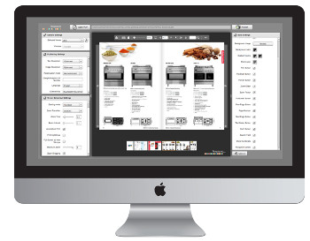

.. ==================================================
.. FOR YOUR INFORMATION
.. --------------------------------------------------
.. -*- coding: utf-8 -*- with BOM.

.. include:: ../Includes.txt

.. _introduction:

Introduction
============

FlexPaper is a light weight document viewer component which makes it possible to display and interact with PDF files in
web pages and in Adobe Flex based applications.

To maximize browser and device coverage without compromising on functionality, FlexPaper is able to display documents in
three different formats; HTML, Adobe Flash, HTML5 or any combination of the three. For more information about browser
coverage please `continue reading here <http://flexpaper.devaldi.com/docs_html_flash_html5.jsp>`_.

.. _intro-publishing:

Publishing documents with your Mac or Windows PC
------------------------------------------------

The desktop publisher lets you publish your document or magazine within minutes. It does't matter if you are a PC or a
Mac guy, it works for both. You can read more about
`the desktop publisher here <http://flexpaper.devaldi.com/flip_book_desktop_publisher_mac_pc.jsp>`_.

Publishing documents with TYPO3
-------------------------------

Documents can be published from your TYPO3 server as well. This extension takes care of integrating the start-up scripts
provided by FlexPaper with TYPO3 and FAL (File Abstraction Layer).

.. _what-it-does:

What does it do?
----------------

In addition to streamlining the user experience when uploading documents to your TYPO3 webserver (either using the
official desktop publisher or from the Backend of TYPO3), this extension provides a handy Frontend plugin to let you
easily embed the FlexPaper document viewer into your website.
